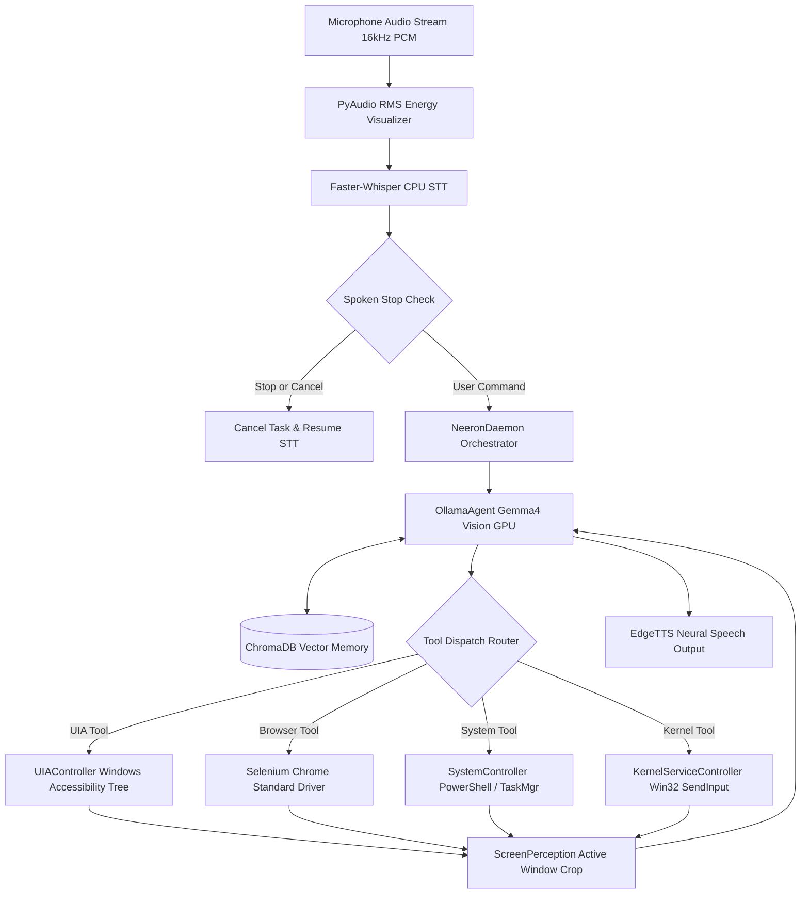
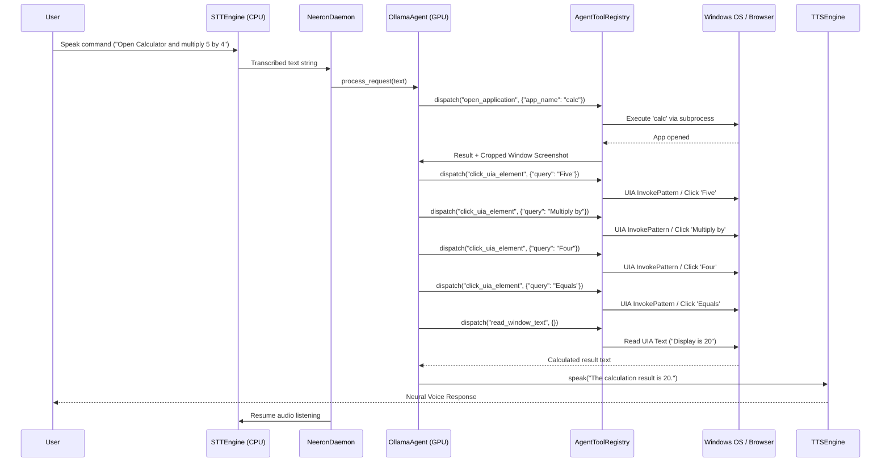

# NEERON AI - COMPREHENSIVE SYSTEM ARCHITECTURE & CODE BLUEPRINT

[](https://www.python.org/)
[](https://ollama.com/)
[](https://microsoft.com)
[](https://pypi.org/project/PyQt6/)
[](LICENSE)

Neeron AI is a **100% private, local, voice-activated multimodal desktop agent** engineered for Windows. It provides full system-wide access to control the Windows OS desktop environment using native UI Automation (UIA), Selenium browser control, Task Manager process analytics, Win32 kernel event monitoring, Window Layout Snap tiling (`SetWindowPos`), Windows Registry theme controls, persistent vector memory, neural speech synthesis, and an **iOS 27 Dynamic Island Glass Capsule HUD**—all optimized to operate within a strict **8GB GPU VRAM hardware budget**.

---

## TABLE OF CONTENTS
1. [AI Model Specifications](#1-ai-model-specifications)
2. [Dynamic Island Floating Glass HUD (`--gui`)](#2-dynamic-island-floating-glass-hud---gui)
3. [System Libraries & Dependencies Matrix](#3-system-libraries--dependencies-matrix)
4. [End-to-End System Pipeline & Diagrams](#4-end-to-end-system-pipeline--diagrams)
5. [Deep Codebase & Module Specifications](#5-deep-codebase--module-specifications)
6. [Complete Tool Definition Matrix](#6-complete-tool-definition-matrix)
7. [Hardware & VRAM Optimization Protocols](#7-hardware--vram-optimization-protocols)
8. [Installation & Setup Blueprint](#8-installation--setup-blueprint)
9. [UN Sustainable Development Goals (SDGs)](#9-un-sustainable-development-goals-sdgs)

---

## 1. AI MODEL SPECIFICATIONS

### A. Multimodal Vision Model (`gemma4:e4b-it-qat`)
* **Architecture**: Gemma 4 Multimodal Vision Transformer tuned for instruction following and visual spatial reasoning.
* **Quantization**: `e4b-it-qat` (4-bit Quantization-Aware Training) for minimal memory footprint and fast inference.
* **Hardware Offloading**: Fully offloaded to NVIDIA GPU VRAM (`num_gpu: 99` via Ollama API) using CUDA device ID `0`.
* **Vision Token Processing**: Processes cropped PNG/JPEG screenshots attached to user messages, converting screen elements into spatial bounding coordinates and actionable tool calls.
* **Context Window Management**: Managed with sliding 50-message context history and strict 2-image payload caps to enforce Ollama API tokenizer stability and eliminate HTTP 400 errors.

### B. Speech-to-Text Model (`faster-whisper` Base)
* **Backend**: CTranslate2 high-performance C++ inference engine wrapping OpenAI's Whisper `base` model.
* **Compute Precision**: `int8` quantized matrix multiplication forced on **CPU** (`whisper_device: "cpu"`), preserving 100% of GPU VRAM for the Gemma4 Vision model.
* **Audio Input Stream**: 16kHz PCM 16-bit mono audio stream captured via PyAudio (`pyaudio.paInt16`).
* **VAD & Energy Threshold**: Custom RMS energy calculation with real-time ASCII terminal waveform rendering (`AudioVisualizer`).

### C. Text-to-Speech Engine (`edge-tts` + `pyttsx3`)
* **Primary Engine**: Microsoft Edge Neural Voice API (`edge-tts`) using the voice `en-US-ChristopherNeural` (natural JARVIS-style male voice).
* **Streaming Protocol**: Asynchronous WebSocket streaming (`asyncio`) saving chunked MP3 files to temporary system storage and playing via Windows COM `MediaPlayer`.
* **Resource Impact**: **0% GPU VRAM / 0% Local GPU compute**.
* **Fallback Engine**: Offline `pyttsx3` wrapper bound to native Windows SAPI5 drivers (`rate: 175`, `volume: 0.9`).

### D. Vector Embedding Model (`ChromaDB`)
* **Embedding Model**: Default ONNX-accelerated `all-MiniLM-L6-v2` dense vector embedding engine.
* **Storage Backend**: SQLite-backed persistent vector index located at `%TEMP%\neeron_memory_db`.
* **Similarity Search**: Cosine similarity vector search returning top matching memory facts for user queries.

---

## 2. DYNAMIC ISLAND FLOATING GLASS HUD (`--gui`)

Neeron AI includes a **macOS / iOS 27-inspired Dynamic Island Floating Glass HUD** widget built natively with `PyQt6`:

* **Authentic Compact Pill Size (`190px × 36px`)**: Top-center desktop widget (`y = 12px`) with rounded `18px` pill corners.
* **Smooth Morphing Geometry (`QVariantAnimation`)**: Morphing size expansion driven by cubic easing curves (`OutCubic`), expanding **strictly when TTS speech is actively playing**.
* **Real-Time Audio FFT Equalizer (`AudioEqualizerWidget`)**: 6 live vertical decibel visualizer bars (`#10B981` / `#00F0FF`) animated during microphone speech recording.
* **System Telemetry Pill**: Real-time GPU VRAM and CPU RAM monitoring displayed on a dedicated line (`GPU 4.2G | RAM 74%`) during execution steps.
* **Vision Thumbnail Preview**: 40x24px rounded desktop screenshot preview frame displayed during visual screen inspection.
* **Interactive Confirmation Approval Cards**: Micro permission cards with keyboard shortcuts (`[Enter] Confirm` / `[Esc] Cancel`) for administrative operations (`manage_registry`, `execute_admin_command`).
* **Deep Matte Black Styling**: Deep obsidian dark linear gradient (`rgba(9, 9, 11, 0.96)`) with a translucent `0.5px` white border (`rgba(255, 255, 255, 0.22)`).

```powershell
# Launch Neeron AI with Dynamic Island GUI HUD
python main.py --gui
```

---

## 3. SYSTEM LIBRARIES & DEPENDENCIES MATRIX

| Library / Module | Purpose in Neeron AI | Core Functions & Classes Utilized |
| :--- | :--- | :--- |
| **`PyQt6`** (`QtCore`, `QtWidgets`, `QtGui`) | macOS / iOS 27 Dynamic Island Floating Glass HUD Capsule | `DynamicIslandHUD`, `AudioEqualizerWidget` (6-bar FFT visualizer), `GreenCircularSpinner` (QPainter arc loader), `QVariantAnimation` (OutCubic geometry morphing), `QSystemTrayIcon`, `QPixmap` (40x24px vision thumbnail preview), `keyPressEvent` (`[Enter]` / `[Esc]` approval cards). |
| **`faster_whisper`** | Speech-to-Text inference engine | `WhisperModel("base", compute_type="int8", device="cpu")` for 100% CPU-bound voice transcription, VAD energy thresholding, and ANSI live terminal renderer (`ANSILiveRenderer`). |
| **`edge_tts`** | Primary Neural Text-to-Speech synthesis | `Communicate(text, voice="en-US-ChristopherNeural")` streaming async MP3 audio over WebSockets with 0% GPU VRAM footprint. |
| **`pyttsx3`** | Fallback Offline Text-to-Speech | Offline `pyttsx3.init()` engine wrapper bound to native Windows SAPI5 audio drivers. |
| **`requests`** / **`ollama`** | Multimodal LLM Vision Reasoning | Interfacing with Ollama HTTP API (`http://localhost:11434/api/chat`) for Gemma 4 (`gemma4:e4b-it-qat`) GPU VRAM offloaded multimodal tool dispatching. |
| **`chromadb`** | Long-Term Persistent Vector Memory | `chromadb.PersistentClient()` with `all-MiniLM-L6-v2` dense embeddings stored in SQLite vector database for fact storage and cosine similarity retrieval. |
| **`selenium`** | Automated Web Browser Automation | `webdriver.Chrome()`, anti-bot CDP script override (`navigator.webdriver` removal), human-like variable typing (`_type_human_like`), webpage element clicking, and URL rendering. |
| **`webdriver_manager`** | Browser Driver Binary Management | `ChromeDriverManager().install()` and `GeckoDriverManager().install()` for automated ChromeDriver and GeckoDriver setup. |
| **`pywinauto`** & **`comtypes`** | Windows UI Automation (UIA) | `pywinauto.Desktop(backend="uia")`, UIA accessibility tree traversal, AutomationId searching, element text reading, and `GetInvokePattern().Invoke()` control clicks. |
| **`pywin32`** (`win32gui`, `win32api`, `win32con`, `win32evtlog`, `winreg`) | Win32 System Control & Event Audit | Native window handles (`FindWindowW`, `GetForegroundWindow`), Windows Registry theme switching (`HKCU\Software\Microsoft\Windows\CurrentVersion\Themes\Personalize`), System Event Log reading, and SCM integration. |
| **`ctypes`** | Hardware Mouse Events & Layout Snapping | Win32 `SetWindowPos` window snapping (50/50 left/right split, top split, center, maximize, minimize), `SetCursorPos`, `mouse_event` (DOWN/UP), and `SetProcessDPIAware`. |
| **`psutil`** | Real-Time Telemetry & Process Analytics | `psutil.virtual_memory().percent` for CPU RAM telemetry counters, active task manager scanning, and resource anomaly detection. |
| **`torch`** | CUDA GPU VRAM Telemetry | `torch.cuda.memory_allocated()` for real-time NVIDIA GPU VRAM memory monitoring inside the Dynamic Island HUD. |
| **`pyautogui`** | Desktop GUI Input Control | Desktop mouse clicks (`click`), hotkey combinations (`win+left`, `win+right`, `win+tab`), text typing, and screen coordinate mapping. |
| **`pyaudio`** | Live Microphone Audio Input Stream | Capturing 16kHz PCM 16-bit mono audio stream (`pyaudio.paInt16`) with RMS decibel calculation. |
| **`Pillow`** (`PIL.Image`, `PIL.ImageGrab`) | Image Processing & Perception | Desktop screenshot capture, active application window bounding box cropping, thumbnail scaling for HUD preview, and PNG/JPEG byte stream encoding. |
| **`opencv-python`** (`cv2`, `numpy`) | Computer Vision Matrix Processing | Image matrix manipulation, template matching, and numpy array slicing (`np.abs(audio_data) > 0.015`) for audio VAD silence trimming. |

---

## 4. END-TO-END SYSTEM PIPELINE & DIAGRAMS

### A. High-Level System Dataflow



### B. Agent Tool Execution Sequence



---

## 3. DEEP CODEBASE & MODULE SPECIFICATIONS

### A. Core Coordination & Entry Point

#### 1. `main.py`
* **Role**: Primary application bootstrap entry point.
* **Implementation Details**: Suppresses HuggingFace/Tokenizer parallelism warnings, configures process environment variables, and delegates execution to `start_daemon("neeron_config.json")`.

#### 2. `neeron/config.py` (`NeeronConfig`)
* **Role**: Central configuration management class.
* **Implementation Details**: Encapsulates datastructure defaults using `@dataclass`. Handles JSON serialization/deserialization to `neeron_config.json` with logging fallback defaults.
* **Key Fields**: `wake_word` ("hello"), `model` ("gemma4:e4b-it-qat"), `whisper_device` ("cpu"), `whisper_compute` ("int8"), `cuda_device_id` (0).

#### 3. `neeron/daemon.py` (`NeeronDaemon`)
* **Role**: Main continuous orchestrator loop.
* **Implementation Details**: Instantiates `STTEngine`, `TTSEngine`, `ScreenPerception`, `SystemController`, `GUIController`, `UIAController`, `PersistentMemoryDB`, `KernelServiceController`, and `OllamaAgent`. Executes `run_forever()` while loop catching `KeyboardInterrupt` for graceful subsystem cleanup.

---

### B. Speech & Audio Processing Layer (`neeron/audio/`)

#### 1. `neeron/audio/stt.py` (`STTEngine`)
* **Role**: Speech-to-Text transcriber and audio input loop manager.
* **Key Methods**:
  * `_calculate_energy(data)`: Computes Root Mean Square (RMS) volume from raw 16-bit PCM audio bytes using `struct.unpack`.
  * `listen()`: Opens PyAudio stream, visualizes audio levels via `AudioVisualizer`, accumulates frames exceeding `energy_threshold`, feeds frames to `WhisperModel.transcribe()`, detects spoken `"stop"` / `"cancel"` keywords, and returns command text.

#### 2. `neeron/audio/tts.py` (`TTSEngine`)
* **Role**: Dual-engine text-to-speech output generator.
* **Key Methods**:
  * `_speak_edge_tts(text)`: Asynchronously streams neural voice synthesis from Microsoft Edge TTS servers, saves temporary `.mp3` file, and executes Windows COM `MediaPlayer` via PowerShell.
  * `speak(text)`: Tries `_speak_edge_tts()` first; falls back to `pyttsx3.say()` and `runAndWait()` if offline.

#### 3. `neeron/audio/visualizer.py` (`AudioVisualizer`)
* **Role**: Real-time terminal waveform renderer.
* **Implementation Details**: Maps raw RMS energy floats to ASCII block characters `[' ', '▂', '▃', '▄', '▅', '▆', '▇', '█']` for terminal feedback.

---

### C. Agent Reasoning & Memory Layer (`neeron/agent/`)

#### 1. `neeron/agent/llm.py` (`OllamaAgent`)
* **Role**: Multimodal reasoning loop executing sequential tool calls.
* **Key Methods**:
  * `process_request(user_prompt)`: Appends user prompt to `ConversationManager`, calls `ollama.chat(model, messages, tools)`, parses function calls, coerces JSON argument strings into dictionaries, dispatches tool execution, attaches active window cropped screenshots into a `role: "user"` message payload, and loops until `task_completed` is invoked.

#### 2. `neeron/agent/conversation.py` (`ConversationManager`)
* **Role**: History deque management and message payload sanitizer.
* **Key Methods**:
  * `clean_invalid_images()`: Scans history deque and removes missing image file paths.
  * `get_history()`: Reverses history, enforces that `images` fields are attached **strictly to `role: "user"` messages** (Ollama API constraint), caps active image attachments to the **latest 2 screenshots**, and returns sanitized conversation history.

#### 3. `neeron/agent/memory_db.py` (`PersistentMemoryDB`)
* **Role**: Vector memory interface using ChromaDB.
* **Key Methods**:
  * `store_memory(memory_id, text, metadata)`: Upserts document text into `neeron_longterm_memory` collection.
  * `query_memory(query_text, n_results)`: Queries vector index via cosine similarity and returns formatted text facts.

#### 4. `neeron/agent/tools.py` (`AgentToolRegistry`)
* **Role**: Tool JSON schema registration and tool execution router.
* **Implementation Details**: Defines JSON schema array for 21 tools and routes string tool names in `dispatch(name, args)` to underlying controllers (`SystemController`, `UIAController`, `KernelServiceController`, `PersistentMemoryDB`).

---

### D. Windows OS & Browser Controller Layer (`neeron/os_world/`)

#### 1. `neeron/os_world/uia_controller.py` (`UIAController`)
* **Role**: Native Windows UI Automation (UIA) API Accessibility Tree parser.
* **Key Methods**:
  * `inspect_active_window_elements()`: Sets `auto.SetGlobalSearchTimeout(2.0)`, gets `GetForegroundWindow()`, traverses control hierarchy, and extracts Name, ControlType, AutomationId, and BoundingRectangle.
  * `click_uia_element(query)`: Searches active window tree for control matching `query`, invokes `InvokePattern`, `LegacyIAccessiblePattern.DoDefaultAction()`, or fallback center-point click.
  * `read_active_window_text()`: Traverses document and text controls in foreground window and extracts combined text lines.

---

## 5. DEEP CODEBASE & MODULE SPECIFICATIONS

#### 1. `neeron/agent/llm.py` (`OllamaAgent`)
* **Role**: Multimodal reasoning core orchestrating Ollama API calls and iterative tool dispatching.
* **Key Methods**:
  * `process_request(user_prompt)`: Appends user query, fetches active screen snapshot, dispatches tools in a sequential loop (up to 15 steps), handles `ask_user_voice` interruptions, and invokes `task_completed` upon verification.
  * `clean_invalid_images()`: Scans history buffer and strips deleted/stale image paths before sending request payloads.

#### 2. `neeron/os_world/system.py` (`SystemController`)
* **Role**: Shell command executor, Selenium Chrome driver manager, and Task Manager analytics engine.
* **Key Methods**:
  * `get_browser_driver()`: Initializes Selenium ChromeDriver in Standard Legitimate Mode with CDP `navigator.webdriver = undefined` override and anti-automation switches.
  * `browser_type(query, text)`: Types text character-by-character using `_type_human_like()` with variable random delays (70ms–170ms per keypress).
  * `browser_click(query)`: Finds element by text, ID, CSS, or XPath, clicks element, and polls up to 5 seconds for URL redirection.
  * `analyze_task_manager()`: Launches `taskmgr`, iterates processes via `psutil`, computes RAM RSS MB and CPU %, sorts top consumers, and flags processes running from temporary directories.
  * `execute_shell(command)`: Validates command against unsafe destruction patterns and executes via PowerShell/CMD.
  * `set_windows_theme(mode)`: Switches Windows OS Theme between Dark and Light mode via `winreg`.
  * `set_screen_brightness(level)`: Sets display screen brightness via WMI PowerShell.
  * `manage_window_layout(action)`: Snaps active window to 50/50 split, top split, center, maximize, or minimize via Win32 `SetWindowPos`.

#### 3. `neeron/os_world/kernel_controller.py` (`KernelServiceController`)
* **Role**: Low-level Win32 kernel event reader, hardware input injector, and security auditor.
* **Key Methods**:
  * `check_kernel_events()`: Opens Windows Event Log (`win32evtlog`) for System and ETW event providers.
  * `inject_hardware_click(x, y)`: Calls Win32 `SetCursorPos` and `mouse_event` (SendInput API) to inject hardware-level clicks below application event filters.
  * `inspect_kernel_drivers()`: Inspects active Windows Filter Drivers (`fltmc filters`) and kernel driver modules.
  * `audit_security_events(max_events)`: Audits recent Windows Security Event Logs (failed logons, privilege escalation, process creation).
  * `audit_network_sockets()`: Audits open listening network ports and bound process IDs using `Get-NetTCPConnection`.
  * `audit_scheduled_persistence()`: Audits active scheduled tasks and startup persistence hooks.

#### 4. `neeron/os_world/vision.py` (`ScreenPerception`)
* **Role**: Active window screenshot cropping and perception engine.
* **Key Methods**:
  * `capture_screenshot()`: Obtains active focused window handle via `pygetwindow.getActiveWindow()`, clips bounding rectangle `(left, top, width, height)`, captures cropped screen region via `mss`, saves timestamped file to temporary directory, and returns image path.
  * `cleanup()`: Removes temporary screenshot files on application shutdown.

#### 5. `neeron/os_world/app_manager.py` (`DesktopAppManager`)
* **Role**: Windows Start Menu shortcut indexer and app launcher.
* **Key Methods**:
  * `open_app(app_name)`: Handles special cases (e.g. `calc` shell launch), searches indexed Start Menu `.lnk` shortcuts, and executes application via `subprocess.Popen`.

#### 6. `neeron/os_world/gui_controller.py` (`GUIController`)
* **Role**: PyAutoGUI desktop mouse and keyboard fallback wrapper.
* **Key Methods**: `click(x, y)`, `type_text(text)`, `press_hotkey(keys)`.

---

## 6. COMPLETE TOOL DEFINITION MATRIX

| Tool Name | Class Source | Parameters | Functional Description |
| :--- | :--- | :--- | :--- |
| **`task_completed`** | `AgentToolRegistry` | `summary` (string) | Signals completion and logs final task verification summary. |
| **`ask_user_voice`** | `AgentToolRegistry` | `question` (string) | Speaks clarification question via TTS and listens for user voice reply. |
| **`store_memory`** | `PersistentMemoryDB` | `memory_id` (str), `text` (str) | Stores fact or preference permanently in ChromaDB vector index. |
| **`query_memory`** | `PersistentMemoryDB` | `query` (str) | Queries vector memory for matching facts or stored instructions. |
| **`check_kernel_events`**| `KernelServiceController` | None | Queries Windows System Event Logs & ETW kernel process events. |
| **`inject_hardware_click`**| `KernelServiceController` | `x` (int), `y` (int) | Injects hardware mouse click via Win32 `SendInput` API. |
| **`inspect_kernel_drivers`**| `KernelServiceController` | None | Inspects active Windows Filter Drivers (`fltmc`) and kernel driver modules. |
| **`audit_security_events`**| `KernelServiceController` | `max_events` (int) | Audits recent Windows Security Event Logs (failed logons, process creation). |
| **`audit_network_sockets`**| `KernelServiceController` | None | Audits listening network ports, TCP/UDP sockets, and bound process IDs. |
| **`audit_scheduled_persistence`**| `KernelServiceController` | None | Audits active scheduled tasks and startup persistence hooks. |
| **`set_windows_theme`** | `SystemController` | `mode` ('dark'/'light') | Switches Windows OS Theme between Dark Mode and Light Mode via `winreg`. |
| **`set_screen_brightness`**| `SystemController` | `level` (int 0-100) | Sets display screen brightness level via WMI PowerShell. |
| **`manage_window_layout`**| `SystemController` | `action` (str) | Snaps active window to 50/50 split, top split, center, max, or min via `SetWindowPos`. |
| **`analyze_task_manager`**| `SystemController` | None | Opens Task Manager (`taskmgr`), scans RAM/CPU, and flags anomalies. |
| **`inspect_uia_tree`**| `UIAController` | None | Parses native Windows UIA accessibility tree of foreground window. |
| **`read_window_text`** | `UIAController` | None | Reads document text and edit box values directly from active window. |
| **`click_uia_element`**| `UIAController` | `query` (string) | Invokes/clicks GUI control natively by UIA Name, ID, or Fuzzy Match. |
| **`read_file`** | `SystemController` | `filepath` (string) | Reads file text content from local disk safely. |
| **`write_file`** | `SystemController` | `filepath` (str), `content` (str), `append` (bool) | Creates, writes, or appends text content to a local file on disk. |
| **`inspect_system_services`**| `SystemController` | None | Queries running administrative Windows Services and system status. |
| **`manage_virtual_desktops`**| `SystemController` | `action` ('list'/'create'/'next'/'prev') | Manages Windows Virtual Desktops (create, switch, list). |
| **`open_browser`** | `SystemController` | `url` (string) | Opens webpage URL in Selenium Chrome standard driver. |
| **`browser_click`** | `SystemController` | `query` (string) | Clicks element on active webpage by visible text, ID, or CSS. |
| **`browser_type`** | `SystemController` | `query` (str), `text` (str) | Types text into webpage input field with human-like delays. |
| **`browser_scroll`** | `SystemController` | `direction` ("down"/"up") | Scrolls active webpage up or down. |
| **`open_application`** | `DesktopAppManager` | `app_name` (string) | Opens desktop application binary or Start Menu shortcut. |
| **`close_application`**| `DesktopAppManager` | `app_name` (string) | Terminates application process by name. |
| **`execute_shell`** | `SystemController` | `command` (string) | Executes PowerShell or CMD command with safety validator. |
| **`inspect_screen`** | `ScreenPerception` | None | Captures cropped active window screenshot for vision analysis. |
| **`gui_click`** | `GUIController` | `x` (int), `y` (int) | Clicks mouse at explicit screen pixel coordinates (x, y). |
| **`gui_type`** | `GUIController` | `text` (string) | Types text into currently focused control. |
| **`gui_hotkey`** | `GUIController` | `keys` (array of str) | Presses key combination (e.g. `['ctrl', 's']`). |

---

## 7. HARDWARE & VRAM OPTIMIZATION PROTOCOLS

```
+---------------------------------------------------------------------------------+
|                       SYSTEM HARDWARE VRAM BUDGET ALLOCATION                    |
+---------------------------------------------------------------------------------+
|  NVIDIA GPU VRAM (8GB BUDGET)           |  HOST SYSTEM CPU & RAM                |
|  ===========================            |  =====================                |
|  • Ollama Gemma4 Vision Model            |  • Faster-Whisper STT (CPU int8)      |
|    (num_gpu: 99 offloaded layers)       |  • PyAudio Microphone Stream          |
|  • ChromaDB Vector Store Index          |  • Microsoft EdgeTTS Speech Output    |
|  • Active Memory Context Buffer         |  • Windows UIA Accessibility Engine   |
+-----------------------------------------+---------------------------------------+
```

### Key Optimization Directives:
1. **CPU Whisper Offloading**: `faster-whisper` runs strictly on CPU (`whisper_device: "cpu"`), preserving 100% of GPU VRAM for the vision LLM.
2. **Ollama Tokenizer Compliance**: Screenshots are attached to `role: "user"` message payloads, and active context is capped to the **latest 2 images**, eliminating HTTP 400 tokenization errors.
3. **Application Window Cropping**: `ScreenPerception` clips screenshots strictly to foreground application bounds, reducing image dimension overhead and accelerating vision inference.

---

## 8. INSTALLATION & SETUP BLUEPRINT

### Prerequisites
* **OS**: Windows 10 or Windows 11 (64-bit).
* **Python**: Version 3.10 or higher.
* **Ollama**: Installed and running locally (`http://localhost:11434`).

### Execution Commands
```powershell
# 1. Pull Gemma4 Vision Model in Ollama
ollama pull gemma4:e4b-it-qat

# 2. Clone Repository
git clone https://github.com/tharun-37/Neeron-AI.git
cd Neeron-AI

# 3. Create & Activate Virtual Environment
python -m venv venv
.\venv\Scripts\activate

# 4. Install Dependencies
pip install -r requirements.txt

# 5. Launch Neeron AI Daemon
python main.py
```

---

## 9. UN SUSTAINABLE DEVELOPMENT GOALS (SDGs)

* **SDG 9: Industry, Innovation, and Infrastructure (Target 9.5)**: Advances edge AI architecture by executing vision, speech recognition, and OS automation locally on consumer hardware.
* **SDG 10: Reduced Inequalities (Target 10.2)**: Acts as an assistive accessibility tool for users with physical or motor impairments by enabling hands-free OS control via native Windows UIA.
* **SDG 4: Quality Education (Target 4.4)**: Provides an open-source educational blueprint for researchers and developers studying local multimodal AI execution.
* **SDG 12: Responsible Consumption and Production (Target 12.2)**: Reduces e-waste and cloud data center energy consumption by running AI models locally on existing consumer hardware.

---

## LICENSE
Distributed under the **MIT License**. See `LICENSE` for details.
